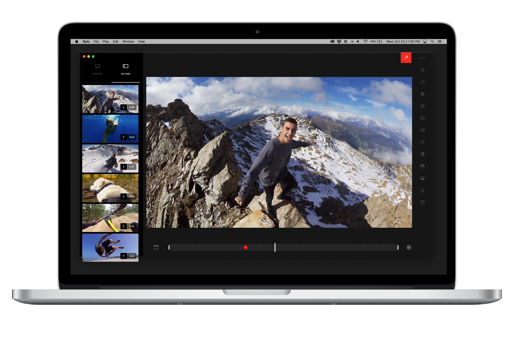
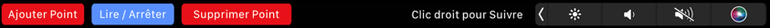

# RyloDesktopApp - Modified French & Touch Bar Version for MacOs
Rylo Desktop App Remake

INSTALL NOTES
---
You need a Mac with Intel or M1/Mx chip
With Visual Studio Code or Js Editor :
In the terminal in Visual Studio Code > npm install
In the node_modules, replace the automaticaly installed standard "core-js" files with the uncompressed core-js.zip files stored in /bin folder (For Rylo app to Work, you need these modified "core-js" files).
Don't delele /bin folder

If the install fails, it is due to errors in npm electron-builder (you can remove it)
version 1.0.8b15 : Electron-Builder remplaced bay Electron-Packager to avoid bugs

RUN STEP
---
In the Terminal / Visual Studio Code > npm start

BUILD STEP
---
npm run build

Enjoy !

For now, Touch Bar addition French version

# FONCTIONALITIES

- Fonctions Touch Bar : ajouter point, jouer & mettre en pause la vidéo, supprimer point, exporter, annuler export
- Export 3k & 4k au lieu du 1080p d'origine

Si vous aimez mes programmes, <a href="https://www.paypal.com/donate/?hosted_button_id=GY5LTDDPZ2HZG"> vous pouvez faire un don PayPal ;)</a>

Historique des versions :

v16 du 23/02/2025 = v1.0.8 Beta 12
Correction d'un bug concernant le mode fenêtré ou plein écran de la fenêtre principale

